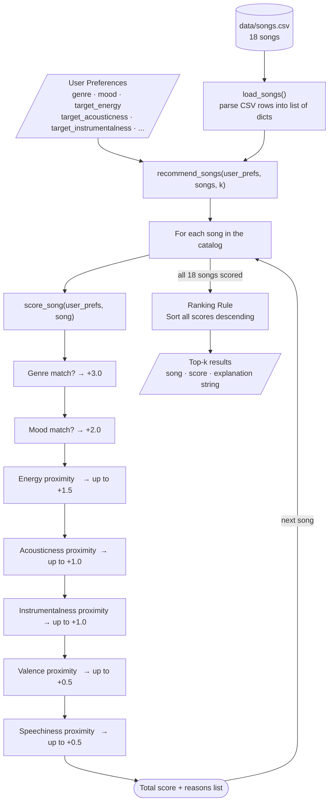

# 🎵 Music Recommender Simulation

## Project Summary

In this project you will build and explain a small music recommender system.

Your goal is to:

- Represent songs and a user "taste profile" as data
- Design a scoring rule that turns that data into recommendations
- Evaluate what your system gets right and wrong
- Reflect on how this mirrors real world AI recommenders

Replace this paragraph with your own summary of what your version does.

---

## How The System Works

Real-world recommenders like Spotify or YouTube analyze patterns across millions of users and songs — tracking what you skip, replay, or save — to build a detailed model of your taste. They use collaborative filtering (what people like you enjoyed) and content-based filtering (matching audio features of songs you liked to new ones). This simulation focuses on the content-based side: it takes a user's stated preferences and compares them directly against each song's features using a weighted scoring formula. Rather than learning from behavior over time, the system prioritizes explicit taste signals — genre match first, then mood, then how close a song's energy level is to what the user wants. The goal is a transparent, explainable recommender where you can see exactly why each song was chosen.

### Song Features

Each `Song` object stores the following attributes:

| Feature | Type | Description |
|---|---|---|
| `id` | int | Unique identifier |
| `title` | str | Song title |
| `artist` | str | Artist name |
| `genre` | str | Genre label (e.g. pop, lofi, rock) |
| `mood` | str | Mood label (e.g. happy, chill, intense) |
| `energy` | float (0–1) | How energetic the track feels |
| `tempo_bpm` | float | Beats per minute |
| `valence` | float (0–1) | Musical positivity (high = upbeat) |
| `danceability` | float (0–1) | How suitable the track is for dancing |
| `acousticness` | float (0–1) | How acoustic (vs. electronic) the track sounds |

### UserProfile Features

Each `UserProfile` stores what the user has told the system about their taste:

| Feature | Type | Description |
|---|---|---|
| `favorite_genre` | str | The genre they want to hear |
| `favorite_mood` | str | The mood they are looking for |
| `target_energy` | float (0–1) | Their preferred energy level |
| `likes_acoustic` | bool | Whether they prefer acoustic over electronic sounds |

### Algorithm Recipe

The scoring formula is the core decision engine. Every song is judged by the same seven rules in order, and the results are summed into a single score:

| Rule | Feature | Max Points | How it works |
|---|---|---|---|
| 1 | Genre match | **+3.0** | Full points if `song.genre == user.favorite_genre`, zero otherwise |
| 2 | Mood match | **+2.0** | Full points if `song.mood == user.favorite_mood`, zero otherwise |
| 3 | Energy proximity | **up to +1.5** | `1.5 × (1 - \|target_energy - song.energy\|)` — closer = more points |
| 4 | Acousticness proximity | **up to +1.0** | `1.0 × (1 - \|target_acousticness - song.acousticness\|)` |
| 5 | Instrumentalness proximity | **up to +1.0** | `1.0 × (1 - \|target_instrumentalness - song.instrumentalness\|)` |
| 6 | Valence proximity | **up to +0.5** | `0.5 × (1 - \|target_valence - song.valence\|)` |
| 7 | Speechiness proximity | **up to +0.5** | `0.5 × (1 - \|target_speechiness - song.speechiness\|)` |

**Maximum possible score: 9.5 points.**
All songs are then sorted by total score (highest first) and the top-k are returned as recommendations.

**Why these weights?** Genre (3.0) outweighs everything else because a genre mismatch is the most jarring recommendation failure — a jazz fan getting a rock song feels broken regardless of how well the energy matches. Mood (2.0) comes second because it sets the listening context. The numerical features (energy, acousticness, etc.) act as fine-tuning after the categorical filters have done the heavy lifting.

### Data Flow Diagram

The diagram below shows how a single song travels from the CSV file to a ranked result:




**Reading the diagram:**
- The two inputs — user preferences and the CSV — feed into `recommend_songs()` at the top
- The loop node represents `recommend_songs()` iterating; each pass calls `score_song()` once
- Inside `score_song()` the seven scoring steps run in order and accumulate a total
- After all songs are scored the loop exits into the Ranking Rule (a single `sorted()` call)
- The output is a list of `(song, score, explanation)` tuples, sliced to the top-k

---

## Getting Started

### Setup

1. Create a virtual environment (optional but recommended):

   ```bash
   python -m venv .venv
   source .venv/bin/activate      # Mac or Linux
   .venv\Scripts\activate         # Windows

2. Install dependencies

```bash
pip install -r requirements.txt
```

3. Run the app:

```bash
python -m src.main
```

### Running Tests

Run the starter tests with:

```bash
pytest
```

You can add more tests in `tests/test_recommender.py`.

---

## Experiments You Tried

The screenshots below show the terminal output from running `python -m src.main`, displaying song titles, scores, score bars, and the reasons behind each recommendation for all three user profiles.


---

## Limitations and Risks

### Potential Biases

**Genre over-prioritization.** Genre carries 3.0 points — more than mood, energy, acousticness, instrumentalness, valence, and speechiness combined (max 5.5 pts). This means a mediocre pop song that matches the user's genre will almost always outscore a genuinely great lofi song that matches every numerical preference. The system might over-prioritize genre, ignoring great songs that fit the user's mood and energy perfectly but sit in the "wrong" genre bucket.

**Catalog representation bias.** The 18-song catalog skews toward Western genres and mostly reflects a young, English-speaking listener's taste. Genres like K-pop, Latin, Afrobeats, or classical Indian music are absent. A user whose preferred genre is not in the catalog will get zero genre-match points for every song, making the recommender fall back on mood and energy alone — a much weaker signal.

**Mood label subjectivity.** Mood labels like "chill" or "intense" were assigned manually and reflect one person's interpretation. Two people might describe the same song differently. The system treats these labels as objective facts, which means it will confidently match or mismatch based on labels that could be wrong.

**No diversity enforcement.** The ranking rule returns the top-k highest-scoring songs with no diversity check. For a lofi-focused user, all 5 recommendations could be lofi tracks — technically correct but offering no discovery or variety.

**Cold start problem.** The system only knows what the user explicitly tells it. A new user who says `genre: lofi` but does not specify `target_energy` or `target_instrumentalness` will get weaker, less personalized results because optional features default to neutral values rather than learned preferences.

### Other Limitations

- Works on a catalog of only 18 songs — real recommenders use millions
- Does not understand lyrics, language, cultural context, or artist relationships
- Scores are not normalized, so adding or removing features changes the scale and breaks comparability across experiments

---

## Reflection

Read and complete `model_card.md`:

[**Model Card**](model_card.md)

Write 1 to 2 paragraphs here about what you learned:

- about how recommenders turn data into predictions
- about where bias or unfairness could show up in systems like this


---

## 7. `model_card_template.md`

Combines reflection and model card framing from the Module 3 guidance. :contentReference[oaicite:2]{index=2}  

```markdown
# 🎧 Model Card - Music Recommender Simulation

## 1. Model Name

Give your recommender a name, for example:

> VibeFinder 1.0

---

## 2. Intended Use

- What is this system trying to do
- Who is it for

Example:

> This model suggests 3 to 5 songs from a small catalog based on a user's preferred genre, mood, and energy level. It is for classroom exploration only, not for real users.

---

## 3. How It Works (Short Explanation)

Describe your scoring logic in plain language.

- What features of each song does it consider
- What information about the user does it use
- How does it turn those into a number

Try to avoid code in this section, treat it like an explanation to a non programmer.

---

## 4. Data

Describe your dataset.

- How many songs are in `data/songs.csv`
- Did you add or remove any songs
- What kinds of genres or moods are represented
- Whose taste does this data mostly reflect

---

## 5. Strengths

Where does your recommender work well

You can think about:
- Situations where the top results "felt right"
- Particular user profiles it served well
- Simplicity or transparency benefits

---

## 6. Limitations and Bias

Where does your recommender struggle

Some prompts:
- Does it ignore some genres or moods
- Does it treat all users as if they have the same taste shape
- Is it biased toward high energy or one genre by default
- How could this be unfair if used in a real product

---

## 7. Evaluation

How did you check your system

Examples:
- You tried multiple user profiles and wrote down whether the results matched your expectations
- You compared your simulation to what a real app like Spotify or YouTube tends to recommend
- You wrote tests for your scoring logic

You do not need a numeric metric, but if you used one, explain what it measures.

---

## 8. Future Work

If you had more time, how would you improve this recommender

Examples:

- Add support for multiple users and "group vibe" recommendations
- Balance diversity of songs instead of always picking the closest match
- Use more features, like tempo ranges or lyric themes

---

## 9. Personal Reflection

A few sentences about what you learned:

- What surprised you about how your system behaved
- How did building this change how you think about real music recommenders
- Where do you think human judgment still matters, even if the model seems "smart"

